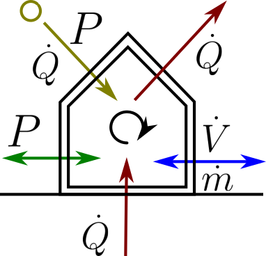
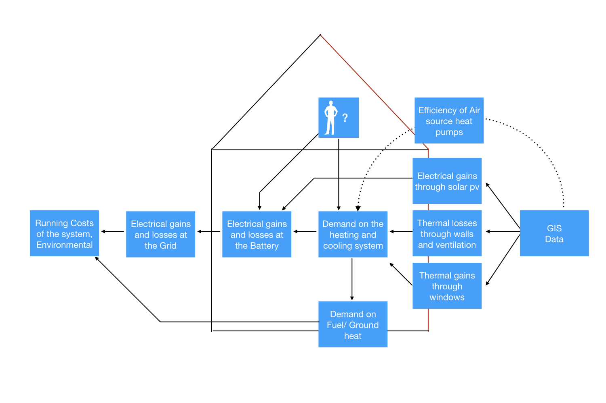
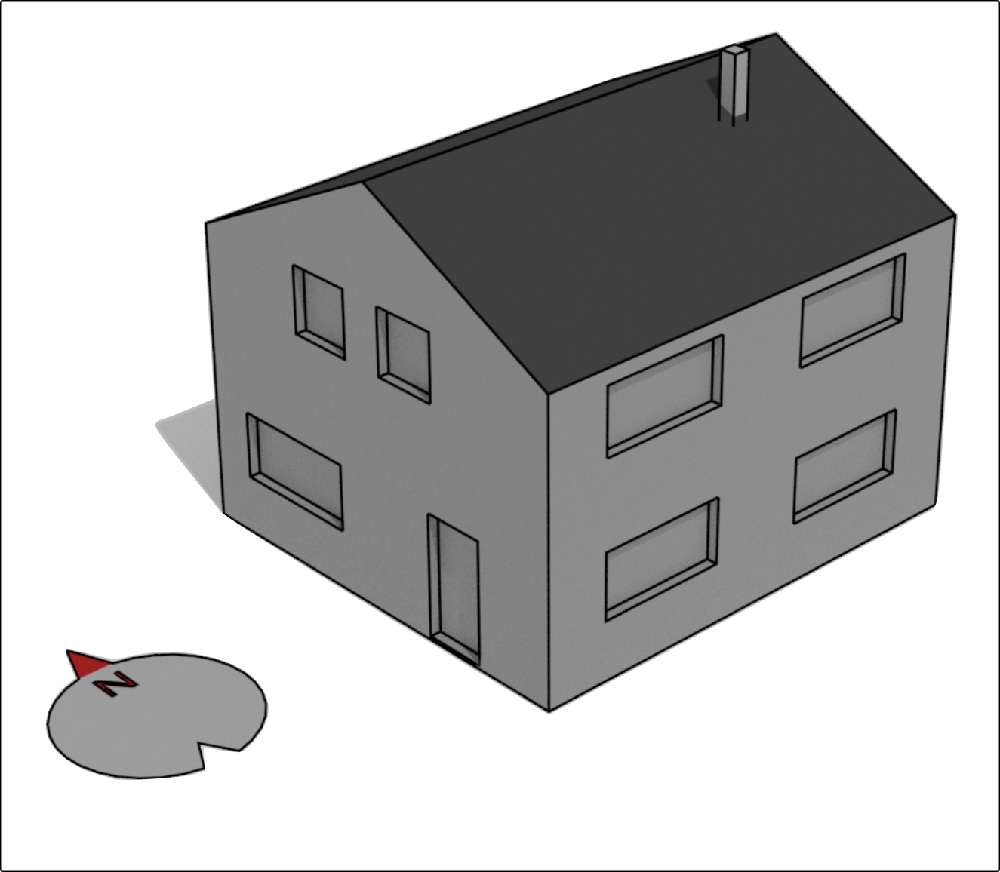
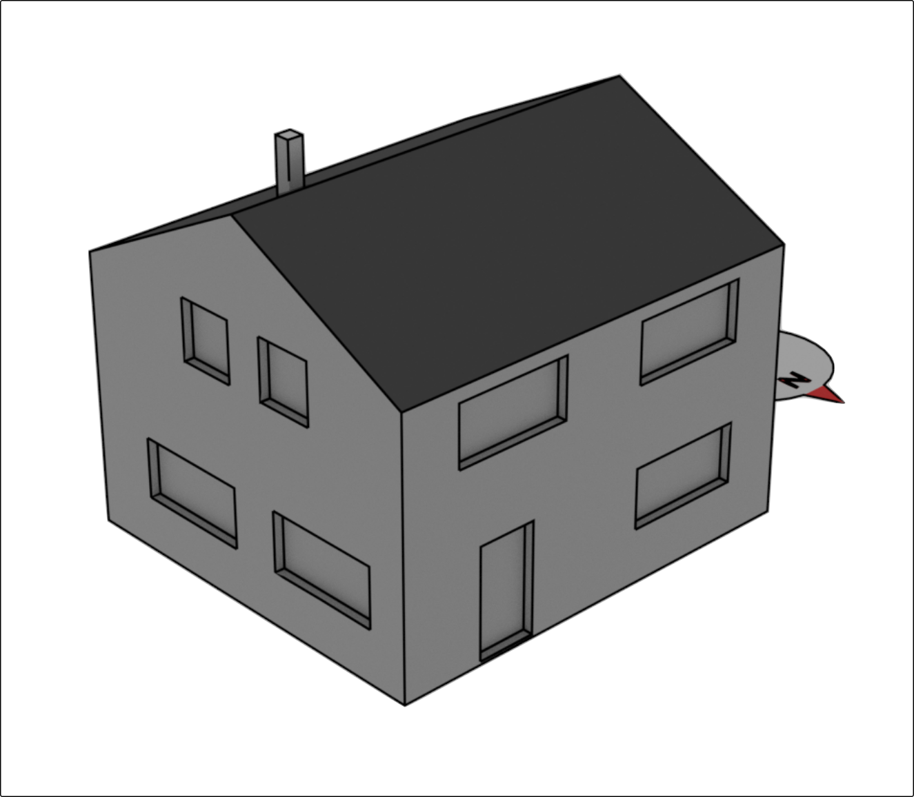
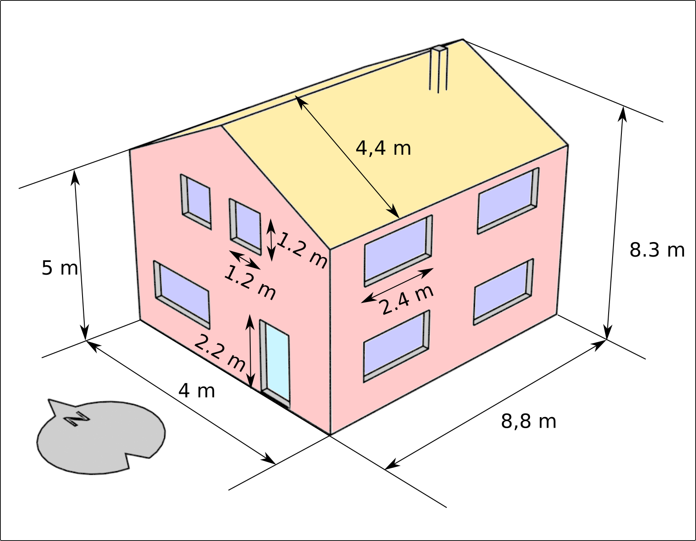
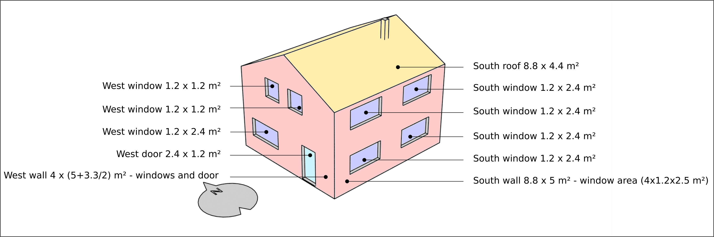
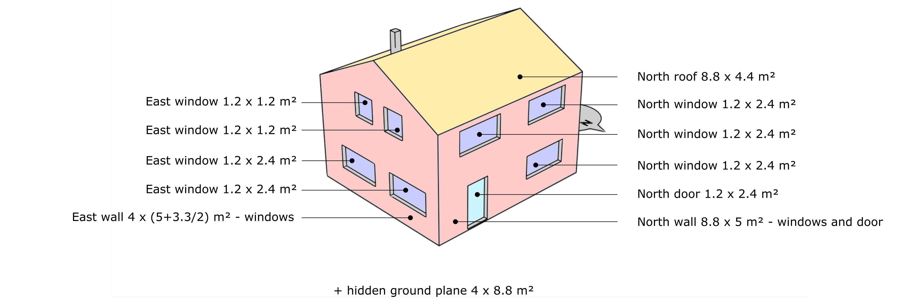

# BuildingEnergySimulation (BES)


BuildingEnergySimulation (BES) is an OpenSource project to simulate energy flow and storage inside a building.

## Dependencies

BES requires the following python packages:

    geocoder, geopy, matplotlib, numba, numpy, pandas, pvlib, requests, scipy

## Installation

Install the dependencies and copy the package into a Python user site directory.

## Quickstart

```python
import BuildingEnergySimulation as bes
building= bes.Building(loc="Markt, 52062 Aachen")
```
Will generate the building as a frame for all components.
The following steps are about adding the relevant components to the building:

#### Walls
Walls are part of the thermal hull of the building. The majority of thermal energy is usually transfered through walls.

Adding a wall to the Building can be done as follows:
```python
bes.Wall.reg(building,area=400,layers=bes.DEFAULT_LAYERS['Brick_Granite'])
```
the layers for walls and windows are lists of dictionary containing the relevant physical parameters to simulate the thermal properties in one dimension: The "Brick_Granite" layer from the integrated sample layers is defined as
```python
[{
'c_v': 1000.0, #Heat capacity in J/kg
'lambda': 0.79, #Heat resistance in W/m²K
'name': 'Brick', #Name
'rho': 1800.0, #Density in kg/m³
'thickness': 0.3}, #Thickness of the layer in m
{
'c_v': 1000.0,
'lambda': 2.80,
'name': 'Granite',
'rho': 2600.0,
'thickness': 0.4}],
```
The area parameter defines the wall area in square meters


#### Windows
Windows are relevant for thermal losses as well as thermal gains through solar irradiance. To add a window it is necessary to define the orientation. azimuth = 0 means the window is facing south, 90 means the window is facing west and -90 means the window is facing east.
```python
bes.Window.reg(building, area= 20, azimuth=0)
```


#### Heating
Adding a heatpump modeled after one specific groundwater based model
```python
bes.Heatpump.reg(building)
```
#### Solar-pv and battery
Adding a simplified solar-pv panel with 14 kWp and a battery with 14kWh capacity and a powergrid connection:
```python
bes.Solar_pv_simple.reg(building, kwp = 14,azimuth = 0, inclination=35)
bes.Battery.reg(building, capacity=14*3.6e6)
bes.Grid.reg(building)
```
#### Connecting all components
Finally the last components need to be connected with each other. The solar panel and heatpump run through the battery, the battery is connected to the grid.

```python
battery = building.get_component('Battery')[0]
battery.connection_in.append(building.get_component('Solar_pv_simple')[0])
battery.connection_in.append(building.get_component('Heatpump')[0])
grid = building.get_component('Grid')[0]
grid.connection_in.append(battery)
```

Now the simulation form January first to January fifth of 2007 can be run as follows
```python
building.simulate('2007-1-1', '2007-1-5')
```
When the processing is finished
```python
building.sim_results
```
contains a pandas Dataframe with all relevant quantities throughout the simulation timeframe and can be written to disk using the functionality integrated into pandas

#### Visualizing and understanding the data.


## How it works

The idea is to model the energy flow as a directed graph from the given environmental factors (outer temperature, solar irradiance) to the available energy sources (grid, fuel).




Physically speaking the simulation is very inaccurate, however it is balanced around how much information about buildings is typically available and the significant influence of inhabitant habits. For example there is no radiator model. But the heat transfer from a underfloor radiator depends on the position and quantity of furniture in the room. It is much easier to assume a given temperature that the room is supposed to have, compared to of solving a differential equation which greatly depends on individual factors which are rarely accessible.

The main goal is to simulate the energy flows on a timescale that can account for the variability of renewable energies.

## A "real" application:

Let's consider a somewhat more complete house:


### Example building overview:
#### Southwest View:


#### Northeast View:


#### Relevant dimensions


### Relevant components
These buildings consist of several relevant components which need to be considered with proper dimensions:
#### Thermal hull in southwest view::


#### Thermal hull in northeast view



#### Configure it in BES:
As usually the project starts with a building object:
```python
import BuildingEnergySimulation as bes
building= bes.Building(loc="Address of the building or list of coordinates [N, E] e.g. [49, 10]")
```
##### Building the thermal hull:
As we see each direction has at least one window and a wall. Additionally the two doors, the roof and the ground plane need to be considered.
###### Parametrizing the spacial dimensions:

The window area in each cardinal direction has to be calculated:
```python
window_area_south = 4*1.2*2.4
window_area_west = 2*1.2*2.4
window_area_north = 3*1.2*2.4
window_area_east = 3*1.2*2.4
```
Additionally the door area can be calculated:
```python
door_area_west = 1.2*2.4
door_area_north = 1.2*2.4
```
Given all the window and door areas, the wall, roof and ground plane areas can be calculated easily:
```python
area_wall_south = 8.8*5-window_area_south
area_wall_west = 4*(5+3.3*.5)-window_area_west-door_area_west
area_wall_north = 8.8*5-window_area_north-door_area_north
area_wall_east = 4*(5+3.3*.5)-window_area_east
area_roof = 2*4.4*8.8
area_ground_plane = 4*8.8
```
Given, that the orientation of the wall is not considered these values can be added to a sum value:
```python
area_wall = area_wall_south+area_wall_west+area_wall_north+area_wall_east
```
##### Parametrizing the building materials:
In addition to the areas of the components, their material makup needs to be defined. While there are some material/layer presets in the BES package, they will most likely be insufficient for an accurate representation. Relevant material parameters for given building materials can be found on the [ubakus](https://www.ubakus.de/u-wert-rechner/) website.

For now it is assumed, that
- the Wall of the building is made of 30cm of brick,
- the roof consists of 10cm wood and a 20cm of insulation,

- windows consist of 3.6cm of insulation glass
- the doors consist of 15cm of pine wood
- the ground floor consists of 10cm of screed and 20cm of XPS insulation

```python
material_db = Materia_db(DEFAULT_MATERIALS)


bes.Wall.reg(building,area=area_wall, layers=bes.DEFAULT_LAYERS['Brick'], ) #Wall
bes.Wall.reg(building,area=area_roof,  layers=bes.DEFAULT_LAYERS['Roof'], ) #Roof
bes.Ground_floor.reg(building, area=area_ground_plane,
                     layers = bes.DEFAULT_LAYERS['Brick']) #Floor
bes.Wall.reg(building,area=door_area_west+door_area_north,  layers=bes.DEFAULT_LAYERS['Roof'], ) #Roof
bes.Window.reg(building, area=window_area_south, layers=bes.DEFAULT_LAYERS['Window'], azimuth=0) #windows
bes.Window.reg(building, area=window_area_west, layers=bes.DEFAULT_LAYERS['Window'], azimuth=90) #windows
bes.Window.reg(building, area=window_area_north, layers=bes.DEFAULT_LAYERS['Window'], azimuth=180) #windows
bes.Window.reg(building, area=window_area_east, layers=bes.DEFAULT_LAYERS['Window'], azimuth=-90) #windows


```


## Comments

This is a "rough around the edges" project, that started and still is a repository of codefragments I used.

The Pvgis data is hardcoded to the year 2007 to keep the load on the Pvgis API low. However the API provides data for the years 2005 through 2015 which can be changed in the Pvgis class .
